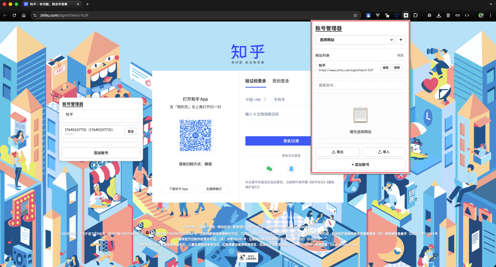

# 账号管理器功能介绍文档

## 📋 项目概述

账号管理器是一款专业的 Chrome 浏览器扩展插件，专为多网站、多账号管理场景设计。通过智能网站匹配、一键自动登录、数据加密存储等核心功能，帮助用户高效、安全地管理不同环境（开发、测试、生产等）下的多个账号。

---

## 🎯 核心功能

### 1. 主界面功能

#### 1.1 界面布局
- **顶部标题栏**：显示"账号管理器"标题
- **网站选择器**：下拉选择框，快速切换不同网站
- **添加网站按钮**：点击"+"按钮快速添加新网站
- **网站列表区域**：可展开/收起的网站列表，显示所有已配置的网站
- **搜索框**：实时搜索账号，支持按用户名或账号搜索
- **账号列表区域**：显示当前选中网站下的所有账号
- **底部操作栏**：包含导出、导入和添加账号功能

#### 1.2 网站管理
- **网站切换**：通过下拉选择器或网站列表快速切换
- **网站信息展示**：显示网站名称和登录页面 URL
- **网站操作**：支持编辑和删除网站
- **网站列表折叠**：可展开/收起网站列表，节省界面空间

#### 1.3 账号管理
- **账号列表展示**：显示用户名、账号、备注等信息
- **账号操作**：支持编辑、删除、登录操作
- **空状态提示**：未选择网站或账号列表为空时显示友好提示
- **实时搜索**：输入关键词快速筛选账号

#### 1.4 数据备份
- **导出功能**：一键导出所有网站和账号数据为 JSON 文件
- **导入功能**：从 JSON 文件恢复数据，支持合并导入

---

### 2. 网站和账号设置界面

#### 2.1 网站设置

**添加/编辑网站表单包含以下字段：**

- **网站名称**（必填）
  - 自定义标识，如"开发网站"、"测试网站"、"生产网站"
  - 用于区分不同环境的网站

- **登录页面 URL**（必填）
  - 完整的登录页面地址，如 `https://dev.example.com/login`
  - 用于智能匹配当前页面
  - 支持路径通配符（如 `https://example.com/login/*`）
  - 悬浮窗只会在匹配此 URL 的页面显示

- **登录按钮 ID**（可选）
  - 登录按钮的 ID 属性
  - 默认值：`ch_login_btn`
  - 留空则使用默认值

- **登录按钮 Class**（可选）
  - 登录按钮的 Class 属性
  - 默认值：`formBtn`
  - 留空则使用默认值

**操作按钮：**
- **取消**：关闭表单，不保存更改
- **保存**：保存网站配置，验证必填字段

#### 2.2 账号设置

**添加/编辑账号表单包含以下字段：**

- **用户名**（必填）
  - 账号的显示名称
  - 用于在列表中识别账号

- **账号**（必填）
  - 登录使用的账号（邮箱或手机号）
  - 用于自动填充登录表单

- **密码**（必填）
  - 登录密码
  - 支持显示/隐藏切换（眼睛图标）
  - 密码经过 AES-GCM 加密存储

- **备注**（可选）
  - 可选的备注信息
  - 便于区分和管理账号
  - 支持多行文本输入

**操作按钮：**
- **取消**：关闭表单，不保存更改
- **保存**：保存账号信息，验证必填字段

---

## 🚀 使用流程

### 首次使用

1. **添加网站**
   - 点击网站选择器右侧的"+"按钮
   - 填写网站名称和登录页面 URL
   - 配置登录按钮 ID 和 Class（可选）
   - 点击"保存"

2. **添加账号**
   - 选择目标网站
   - 点击底部的"+ 添加账号"按钮
   - 填写用户名、账号、密码等信息
   - 点击"保存"

3. **一键登录**
   - 在账号列表中找到要登录的账号
   - 点击账号右侧的"登录"按钮
   - 系统自动打开登录页面并填充表单

### 日常使用

1. **快速切换网站**
   - 使用顶部下拉选择器
   - 或点击网站列表中的网站项

2. **搜索账号**
   - 在搜索框输入关键词
   - 实时筛选匹配的账号

3. **编辑信息**
   - 点击账号或网站的"编辑"按钮
   - 修改信息后保存

4. **数据备份**
   - 定期点击"导出"按钮备份数据
   - 需要恢复时点击"导入"按钮

---

## 🎨 界面特点

### 设计风格
- **手绘风格**：采用线条描边设计，简洁美观
- **现代化 UI**：流畅的交互动画和过渡效果
- **响应式布局**：适配不同屏幕尺寸
- **友好提示**：清晰的错误提示和成功反馈

### 交互体验
- **实时搜索**：输入即时筛选，无需点击
- **折叠展开**：网站列表可折叠，节省空间
- **密码显示**：支持密码显示/隐藏切换
- **拖拽支持**：悬浮面板支持拖拽调整位置

---

## 🔒 安全特性

### 数据加密
- **AES-GCM 加密**：密码使用 Web Crypto API 加密存储
- **本地存储**：所有数据存储在 Chrome 本地存储中
- **无服务器上传**：数据不会上传到任何服务器

### 安全机制
- **XSS 防护**：使用安全的 DOM 操作方法
- **权限控制**：仅请求必要的 Chrome API 权限
- **CSP 策略**：配置内容安全策略，防止代码注入

---

## 📱 双界面模式

### 弹出窗口（Popup）
- **打开方式**：点击扩展图标
- **功能**：完整的网站和账号管理功能
- **适用场景**：添加、编辑、删除操作

### 悬浮面板（Floating Panel）
- **显示条件**：访问匹配的登录页面时自动显示
- **功能**：快速访问当前网站的账号列表
- **特点**：支持拖拽调整位置，不影响正常浏览

---

## 🛠️ 技术特性

### 智能匹配
- **精确匹配**：当前页面 URL 与配置的登录页面 URL 完全一致
- **路径通配符**：支持 `/*` 通配符匹配子路径
- **URL 规范化**：自动忽略查询参数和锚点
- **自动切换**：访问匹配页面时自动切换到对应网站

### 自动登录
- **表单识别**：智能识别页面中的用户名、账号、密码输入框
- **自动填充**：一键自动填充登录表单
- **自动提交**：自动点击配置的登录按钮
- **多种回退**：多种选择器机制，提高成功率

---

## 📊 数据管理

### 数据格式
- **存储格式**：JSON 格式存储
- **数据结构**：包含网站和账号的完整信息
- **时间戳**：记录创建和更新时间

### 导入导出
- **导出格式**：JSON 文件，包含所有数据
- **导入机制**：支持合并导入，相同 ID 的项目会被覆盖
- **数据验证**：自动验证数据格式，确保完整性

---

## 💡 使用技巧

1. **网站命名**：使用清晰的名称区分不同环境，如"开发环境"、"测试环境"、"生产环境"

2. **URL 配置**：使用通配符匹配多个登录页面，如 `https://example.com/login/*`

3. **备注信息**：充分利用备注字段记录账号用途、权限等信息

4. **定期备份**：建议定期导出数据，防止数据丢失

5. **密码安全**：虽然密码已加密，但仍建议设置强密码

---

## ⚠️ 注意事项

1. **删除网站**：删除网站会同时删除该网站下的所有账号，请谨慎操作

2. **导入数据**：导入会合并现有数据，相同 ID 的项目会被覆盖

3. **登录按钮配置**：如果自动登录失败，检查并配置正确的登录按钮 ID 和 Class

4. **数据安全**：不要在公共计算机上使用，定期备份数据

5. **浏览器兼容**：需要 Chrome 88.0 及以上版本

---

## 📞 获取帮助

如有问题或建议，请通过以下方式联系：
- **Github**：https://github.com/nianouth/account-manager.git
- **Issues**：在 Github 仓库提交 Issue

---

## 📝 版本信息

- **当前版本**：v1.1.0
- **最低 Chrome 版本**：88.0
- **许可证**：MIT

---

**⚠️ 重要提示**

本扩展仅用于合法的账号管理目的，请勿用于任何非法用途。使用本扩展即表示您同意自行承担使用风险。

**🔒 安全建议**

- 定期备份数据到安全位置
- 不要在公共计算机上使用
- 设置强密码保护账号信息
- 不要分享导出的数据文件

