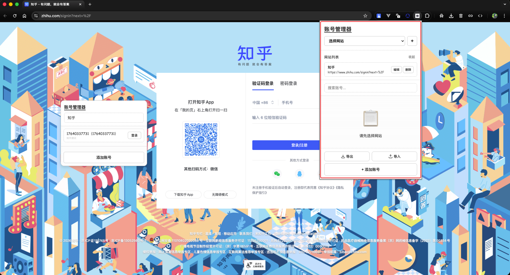

# 账号管理器功能介绍文档

## 📋 项目概述

账号管理器是一款专业的 Chrome 浏览器扩展插件，专为多网站、多账号管理场景设计。通过智能网站匹配、一键自动登录、账号模板复用、多格式导入导出等核心功能，帮助用户高效地管理不同环境（开发、测试、生产等）下的多个账号。

---

## 🎯 核心功能

### 1. 主界面功能

#### 1.1 界面布局
- **顶部标题栏**：显示"账号管理器"标题和网站头像
- **搜索框**：实时搜索账号，支持按用户名或账号搜索（300ms 防抖）
- **胶囊式 Tab 导航**：账号、网站、模板、设置四个 Tab 页
- **账号列表区域**：两层卡片设计（信息层 + 操作层），显示当前网站的账号
- **账号计数徽章**：显示当前网站账号数量
- **底部操作栏**：添加账号等快捷操作

#### 1.2 网站管理（网站 Tab）
- **网站列表**：显示所有已配置的网站名称和登录页面 URL
- **自动匹配**：打开扩展时自动根据当前标签页 URL 匹配并选中对应网站
- **单网站自动选中**：仅有一个网站时自动选中并加载账号
- **网站操作**：支持编辑和删除网站

#### 1.3 账号管理（账号 Tab）
- **账号列表展示**：显示用户名、账号、备注等信息，文本溢出时显示 tooltip
- **⭐ 收藏功能**：收藏常用账号，自动置顶显示
- **📋 一键复制**：快速复制账号和密码到剪贴板
- **账号操作**：支持编辑、删除、登录操作
- **重复检测**：添加/编辑时自动检测同网站下重复账号
- **实时搜索**：输入关键词快速筛选账号
- **空状态引导**：未选择网站或账号列表为空时显示友好提示和快捷添加按钮
- **卡片入场动画**：账号卡片支持 CSS 错落入场动画

#### 1.4 账号模板（模板 Tab）
- **模板组管理**：创建、编辑、删除模板组
- **模板账号管理**：在模板组内添加、编辑、删除通用账号
- **环境关联**：编辑网站时可选择关联的模板，模板账号自动出现在该网站的账号列表中
- **模板标记**：悬浮面板中模板账号显示"模板"标记，与普通账号区分

#### 1.5 数据管理（设置 Tab）
- **JSON 导出**：一键导出所有数据为 JSON 文件，包含版本信息和时间戳
- **CSV 导出**：导出为 CSV 格式，Excel 自动识别 UTF-8 编码
- **JSON 导入**：从 JSON 文件恢复数据，支持合并导入
- **下载导入模板**：下载标准 JSON 导入模板，按格式填写后导入
- **AI 提示词下载**：下载提示词文件，通过 AI 生成符合导入格式的 JSON 数据

---

### 2. 网站和账号设置界面

#### 2.1 网站设置

**添加/编辑网站表单包含以下字段：**

- **网站名称**（必填）
  - 自定义标识，如"开发网站"、"测试网站"、"生产网站"
  - 添加时自动填充当前标签页的标题

- **登录页面 URL**（必填）
  - 完整的登录页面地址，如 `https://dev.example.com/login`
  - 添加时自动填充当前标签页的 URL
  - 支持路径通配符（如 `https://example.com/login/*`）
  - 悬浮面板只会在匹配此 URL 的页面显示

- **关联模板**（可选）
  - 选择要关联的账号模板组
  - 关联后模板中的账号自动出现在该网站下

- **高级设置**（可折叠）
  - **登录按钮 ID**：登录按钮的 ID 属性，留空则自动查找
  - **登录按钮 Class**：登录按钮的 Class 属性，留空则自动查找

#### 2.2 账号设置

**添加/编辑账号表单包含以下字段：**

- **用户名**（必填）
  - 账号的显示名称，用于在列表中识别账号

- **账号**（必填）
  - 登录使用的账号（邮箱或手机号）
  - 用于自动填充登录表单

- **密码**（必填）
  - 登录密码
  - 支持显示/隐藏切换（眼睛图标）

- **备注**（可选）
  - 可选的备注信息，便于区分和管理账号

---

## 🚀 使用流程

### 首次使用

1. **添加网站**
   - 切换到"网站"Tab，点击添加按钮
   - 网站名称和 URL 会自动从当前标签页填充
   - 按需配置高级设置和关联模板
   - 点击"保存"

2. **添加账号**
   - 切换到"账号"Tab，选择目标网站
   - 点击"添加账号"按钮
   - 填写用户名、账号、密码等信息
   - 点击"保存"

3. **一键登录**
   - 访问对应的登录页面
   - 悬浮面板自动显示（智能定位，不遮挡表单）
   - 点击账号的"登录"按钮
   - 系统自动填充并提交登录表单

### 使用账号模板

1. **创建模板**
   - 切换到"模板"Tab，创建模板组
   - 在模板组中添加通用账号

2. **关联环境**
   - 编辑网站，在"关联模板"中选择需要的模板
   - 关联后，模板账号自动出现在该网站下

### 批量导入账号

1. **使用导入模板**
   - 设置 Tab → 点击"下载模板"
   - 按标准 JSON 格式填写数据
   - 使用"导入"功能导入

2. **使用 AI 生成**
   - 设置 Tab → 点击"AI 提示词"
   - 将提示词发送给 AI，描述需要的账号数据
   - AI 生成符合格式的 JSON，导入即可

### 日常使用

1. **快速切换网站** — 打开扩展自动匹配当前页面对应的网站
2. **搜索账号** — 在搜索框输入关键词，实时筛选（Ctrl/Cmd + K 聚焦搜索框）
3. **收藏账号** — 点击星标，常用账号自动置顶
4. **编辑信息** — 在 Popup 或悬浮面板中直接编辑/删除
5. **数据备份** — 定期在设置 Tab 中导出数据（JSON/CSV）

---

## ⌨️ 快捷键

| 快捷键 | 功能 |
|--------|------|
| `Ctrl/Cmd + K` | 聚焦搜索框 |
| `Ctrl/Cmd + N` | 添加新账号 |
| `Esc` | 关闭模态框 |
| `Alt + A` | 切换悬浮面板展开/折叠 |
| `Tab` | 在账号列表中导航 |
| `Enter / Space` | 触发选中账号的登录 |

---

## 🎨 界面特点

### 设计风格
- **Guardian 蓝色主题**：专业安全风格（#3B7DD8），传达信任与安全感
- **设计令牌统一**：颜色、间距、字体等通过 design-tokens.css 统一管理
- **SVG 图标**：全部使用 SVG 图标，跨平台显示一致
- **现代化 UI**：渐变按钮、阴影效果、错落入场动画

### 交互体验
- **实时搜索**：带防抖的即时筛选
- **密码显示/隐藏**：眼睛图标切换
- **拖拽支持**：悬浮面板支持拖拽，使用 translate3d 无卡顿
- **文本溢出提示**：长文本截断时显示 tooltip
- **彩色 Toast 通知**：成功、错误、警告、信息四种类型

---

## 🔒 安全特性

### 安全机制
- **XSS 防护**：使用 `textContent` 和 `createElement`，不使用 `innerHTML`
- **Shadow DOM 隔离**：悬浮面板样式与页面完全隔离
- **权限最小化**：仅请求 `storage`、`activeTab`、`scripting` 权限
- **CSP 策略**：配置内容安全策略，防止代码注入
- **本地存储**：所有数据存储在 Chrome 本地，不会上传到任何服务器

---

## 📱 双界面模式

### 弹出窗口（Popup）
- **打开方式**：点击扩展图标
- **功能**：四 Tab 完整管理界面（账号、网站、模板、设置）
- **适用场景**：添加、编辑、删除、配置、导入导出等操作

### 悬浮面板（Floating Panel）
- **显示条件**：访问匹配的登录页面时自动显示
- **功能**：快速访问当前网站的账号和关联模板账号
- **特点**：
  - 支持拖拽调整位置，位置自动保存
  - 智能定位：自动检测登录表单位置，放置在不遮挡的一侧
  - 支持直接编辑和删除账号
  - 模板账号显示"模板"标记
  - Alt+A 快捷键切换展开/折叠

---

## 🛠️ 技术特性

### 智能匹配
- **精确匹配**：当前页面 URL 与配置的登录页面 URL 完全一致
- **路径通配符**：支持 `/*` 通配符匹配子路径
- **URL 规范化**：自动忽略查询参数和锚点
- **自动切换**：打开扩展时自动匹配当前标签页对应的网站

### 自动登录
- **智能表单识别**：自动识别用户名、邮箱、手机号、密码输入框
- **多选择器匹配**：兼容多种 placeholder、name、type 属性
- **React/Vue 兼容**：使用原生 value setter 兼容受控组件
- **SPA 支持**：支持无 `<form>` 标签的单页应用登录表单
- **自动提交**：智能查找并点击登录按钮，支持多种查找策略
- **hashchange 监听**：用事件监听替代轮询，低 CPU 开销

---

## 📊 数据管理

### 数据格式
- **存储格式**：JSON 格式存储在 Chrome Storage API (local)
- **数据结构**：包含网站、账号、模板组的完整信息
- **时间戳**：记录创建和更新时间

### 导入导出
- **JSON 导出**：完整数据备份，包含版本信息和时间戳
- **CSV 导出**：Excel 兼容的 UTF-8 编码 CSV 文件
- **JSON 导入**：支持合并导入，相同 ID 的项目会被更新
- **导入模板**：下载标准格式模板，按格式填写后导入
- **AI 辅助**：下载提示词文件，通过 AI 生成符合格式的导入数据

---

## 💡 使用技巧

1. **网站命名**：使用清晰的名称区分不同环境，如"开发环境"、"测试环境"、"生产环境"
2. **URL 配置**：使用通配符匹配多个登录页面，如 `https://example.com/login/*`
3. **善用模板**：将多个环境共用的账号放入模板组，关联后自动出现在各环境中
4. **快捷键**：使用 Ctrl+K 快速搜索，Alt+A 快速切换悬浮面板
5. **批量导入**：使用导入模板或 AI 提示词快速批量添加账号
6. **定期备份**：建议定期导出数据（JSON/CSV），防止数据丢失

---

## ⚠️ 注意事项

1. **删除网站**：删除网站会同时删除该网站下的所有账号，请谨慎操作
2. **导入数据**：导入会合并现有数据，相同 ID 的项目会被覆盖
3. **登录按钮配置**：如果自动登录失败，可在网站高级设置中配置正确的登录按钮 ID 和 Class
4. **数据安全**：不要在公共计算机上使用，定期备份数据
5. **浏览器兼容**：需要 Chrome 88.0 及以上版本

---

## 📞 获取帮助

如有问题或建议，请通过以下方式联系：
- **Github**：https://github.com/nianouth/account-manager
- **Issues**：在 Github 仓库提交 Issue

---

## 📝 版本信息

- **当前版本**：v2.1.6
- **最低 Chrome 版本**：88.0
- **许可证**：MIT

---

**⚠️ 重要提示**

本扩展仅用于合法的账号管理目的，请勿用于任何非法用途。使用本扩展即表示您同意自行承担使用风险。

**💡 安全建议**

定期备份数据 • 不在公共设备使用 • 不分享导出文件

