# 全房通账号管理器V1.0.0 Chrome 扩展功能说明文档

## 一、插件概述

### 1.1 产品介绍

全房通账号管理器V1.0.0是一款功能强大的 Chrome 浏览器扩展插件，专为需要管理多个环境和多个账号的用户设计。该插件提供了便捷的账号管理、一键登录、数据加密等核心功能，帮助用户高效、安全地管理各类账号信息。

**产品定位：** 企业级账号管理工具，适用于开发、测试、生产等多环境场景

**核心价值：**
- 提升账号管理效率，告别重复输入账号密码
- 保障数据安全，采用 AES-GCM 加密算法保护敏感信息
- 简化登录流程，实现一键自动登录
- 支持多环境管理，灵活切换不同工作场景

### 1.2 核心特性

1. **双界面操作模式** - 提供弹出页面和悬浮面板两种操作方式
2. **环境管理系统** - 支持开发、测试、生产等多环境配置
3. **智能账号管理** - 完整的账号增删改查功能
4. **一键自动登录** - 智能识别表单并自动填充提交
5. **数据加密保护** - AES-GCM 加密算法保障数据安全
6. **数据备份恢复** - 支持数据导出导入，防止数据丢失

### 1.3 适用场景

- **开发团队**：管理开发、测试、生产环境的多个账号
- **测试人员**：快速切换不同测试账号进行功能验证
- **运维人员**：管理不同环境的系统账号
- **个人用户**：管理多个网站的登录账号

### 1.4 界面展示

**图 1-1：插件主界面概览**

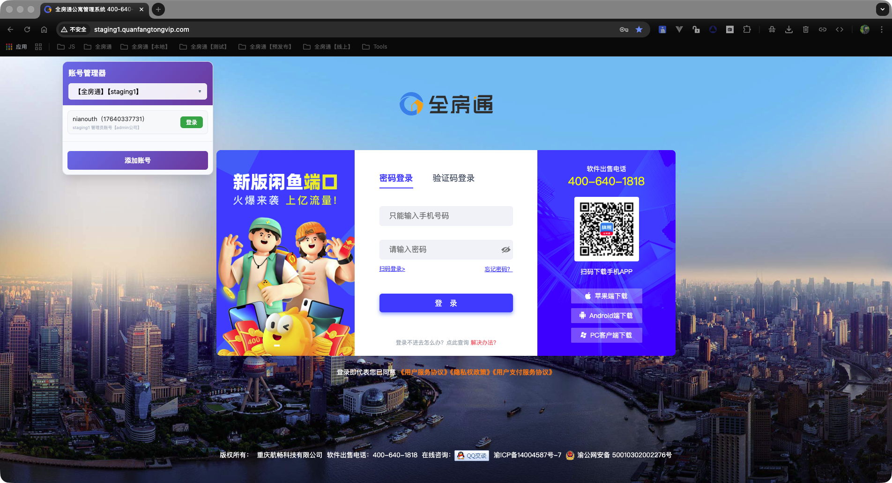

*说明：展示全房通账号管理器V1.0.0的整体界面布局，包括弹出页面和悬浮面板的位置关系*

---

## 二、功能详解

### 2.1 双界面操作模式

全房通账号管理器V1.0.0提供了两种便捷的操作界面，用户可以根据使用习惯和场景选择合适的方式。

#### 2.1.1 弹出页面管理界面

**功能特点：**
- 点击浏览器工具栏的扩展图标即可打开
- 提供完整的环境和账号管理功能
- 界面简洁美观，操作流畅
- 支持环境列表的展开/折叠显示

**主要功能：**
- 环境添加、编辑、删除
- 账号添加、编辑、删除
- 环境切换
- 账号搜索
- 数据备份与恢复

**使用场景：**
- 需要添加或编辑账号信息时
- 需要管理环境配置时
- 需要备份或恢复数据时

**图 2-1：弹出页面管理界面**


*说明：展示弹出页面的完整界面，包括环境列表、账号列表、功能按钮等*

#### 2.1.2 悬浮面板操作界面

**功能特点：**
- 自动注入到所有网页，无需切换标签页
- 固定在页面右上角，不遮挡主要内容
- 支持拖拽调整位置
- 支持折叠/展开，节省页面空间

**主要功能：**
- 快速切换环境
- 查看当前环境的账号列表
- 一键登录操作
- 快速访问弹出页面

**使用场景：**
- 在登录页面快速选择账号登录
- 需要频繁切换账号时
- 不想离开当前页面进行操作时

**交互特性：**
- 面板可拖拽移动位置
- 支持折叠/展开状态切换
- 自动保存面板位置和状态
- 不影响网页正常浏览

**图 2-2：悬浮面板操作界面**

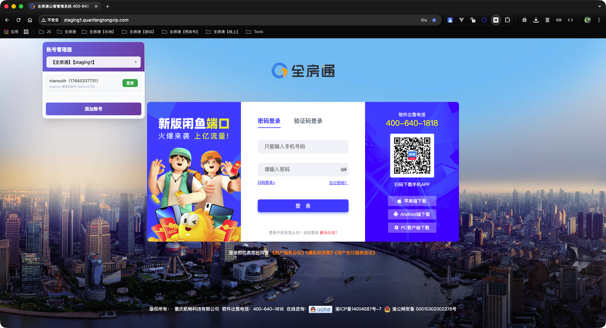

*说明：展示悬浮面板在网页中的显示效果，包括环境选择器、账号列表、登录按钮等*

**图 2-3：悬浮面板折叠状态**

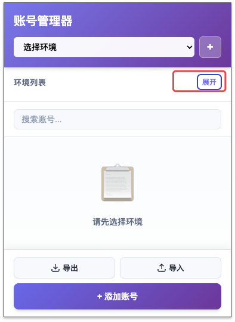

*说明：展示悬浮面板折叠后的紧凑显示效果*

### 2.2 环境管理系统

环境管理系统是全房通账号管理器V1.0.0的核心功能之一，允许用户为不同的工作场景创建独立的环境配置。

#### 2.2.1 环境添加与配置

**环境配置项：**
- **环境名称**：自定义环境标识（如：开发环境、测试环境、生产环境）
- **登录页面 URL**：该环境的登录页面地址（如：https://dev.example.com/login）
- **登录按钮标识**：登录按钮的 ID 或 Class（用于自动点击登录）

**添加步骤：**
1. 点击弹出页面中的"+"按钮
2. 填写环境名称
3. 填写登录页面 URL
4. 配置登录按钮标识（可选）
5. 保存环境配置

**图 2-4：添加环境配置界面**

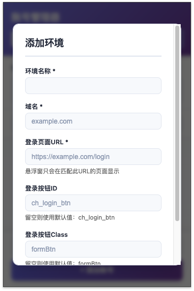

*说明：展示添加环境时的配置对话框，包括各输入字段和保存按钮*

**配置说明：**
- 登录页面 URL 用于自动识别当前页面是否属于该环境
- 登录按钮标识用于一键登录时自动点击提交按钮

#### 2.2.2 环境切换与识别

**自动环境识别：**
- 插件会监听浏览器标签页的 URL 变化
- 当访问到配置的登录页面 URL 时，自动匹配对应的环境
- 悬浮面板和弹出页面会自动切换到匹配的环境
- 显示该环境下的所有账号

**手动环境切换：**
- 在弹出页面的环境选择器中选择目标环境
- 在悬浮面板的环境下拉框中选择目标环境
- 切换后立即显示对应环境的账号列表

**匹配规则：**
- 精确匹配：当前 URL 与登录页面 URL 完全一致
- 路径匹配：支持通配符匹配（如：/login/*）
- 自动忽略 URL 参数和锚点，只匹配协议+域名+路径

#### 2.2.3 多环境支持（开发/测试/生产）

**典型环境配置：**

1. **开发环境**
   - 登录 URL：https://dev.example.com/login
   - 用途：开发调试、功能测试

2. **测试环境**
   - 登录 URL：https://test.example.com/login
   - 用途：集成测试、回归测试

3. **生产环境**
   - 登录 URL：https://example.com/login
   - 用途：正式环境、生产使用

**图 2-5：环境列表展示**

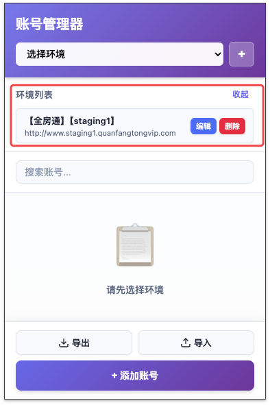

*说明：展示多个环境的列表，包括环境名称、登录URL等信息*

**环境隔离：**
- 每个环境的账号数据完全独立
- 切换环境不会影响其他环境的账号
- 支持为同一环境配置多个账号

### 2.3 账号管理功能

账号管理功能提供了完整的账号信息管理能力，支持为每个环境添加多个账号。

#### 2.3.1 账号添加与编辑

**账号信息字段：**
- **用户名**：账号的显示名称（如：开发账号1、测试账号1）
- **账号**：登录账号（通常是邮箱或用户名）
- **密码**：登录密码（支持明文或加密存储）
- **备注**：账号的备注信息（可选）

**添加账号步骤：**
1. 选择目标环境
2. 点击"添加账号"按钮
3. 填写账号信息
4. 保存账号

**图 2-6：添加账号界面**

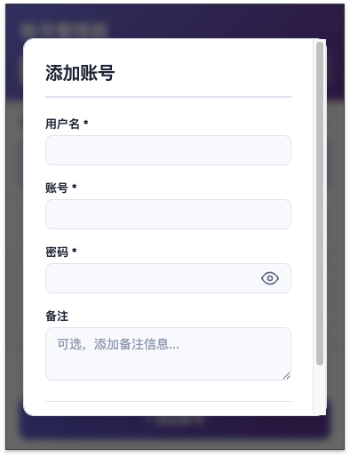

*说明：展示添加账号时的配置对话框，包括用户名、账号、密码、备注等字段*

**编辑账号步骤：**
1. 在账号列表中点击"编辑"按钮
2. 修改账号信息
3. 保存修改

**数据验证：**
- 用户名不能为空
- 账号不能为空
- 密码不能为空
- 自动去除首尾空格

#### 2.3.2 账号信息管理

**账号列表显示：**
- 显示用户名、账号、备注信息
- 密码以加密形式存储，不直接显示
- 支持按环境筛选显示
- 支持搜索功能快速查找

**图 2-7：账号列表展示**


*说明：展示账号列表的显示效果，包括账号信息、操作按钮等*

**账号操作：**
- **查看**：查看账号详细信息
- **编辑**：修改账号信息
- **删除**：删除账号（需确认）
- **登录**：使用该账号一键登录

**账号搜索：**
- 支持按用户名搜索
- 支持按账号搜索
- 支持按备注搜索
- 实时过滤显示结果

#### 2.3.3 账号删除与维护

**删除账号：**
- 点击账号列表中的"删除"按钮
- 弹出确认对话框
- 确认后永久删除账号
- 删除操作不可恢复

**账号维护建议：**
- 定期更新密码
- 及时删除不再使用的账号
- 为账号添加有意义的备注
- 使用清晰的用户名便于识别

### 2.4 智能自动登录

智能自动登录功能可以自动识别网页登录表单，并自动填充账号密码，最后自动点击登录按钮完成登录流程。

#### 2.4.1 一键登录功能

**功能特点：**
- 点击账号列表中的"登录"按钮即可完成登录
- 自动识别当前页面的登录表单
- 自动填充账号和密码
- 自动点击登录按钮提交表单

**使用步骤：**
1. 打开目标网站的登录页面
2. 在悬浮面板或弹出页面中选择账号
3. 点击"登录"按钮
4. 系统自动完成登录流程

**图 2-8：一键登录前（登录页面）**


*说明：展示登录页面的原始状态，表单为空*

**图 2-9：一键登录后（自动填充）**

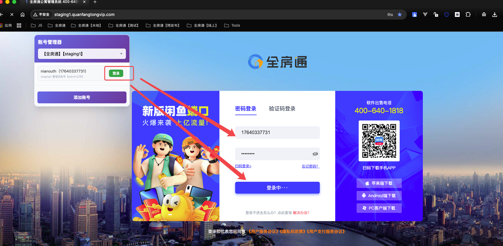

*说明：展示点击登录按钮后，表单自动填充账号密码的效果*

**支持场景：**
- 标准 HTML 表单登录
- 用户名/邮箱 + 密码登录
- 多种常见的表单结构

#### 2.4.2 表单自动填充

**表单识别机制：**
- 自动识别用户名输入框（通过 type="text"、name 属性、placeholder 等）
- 自动识别邮箱输入框（通过 type="email"）
- 自动识别密码输入框（通过 type="password"）
- 支持多种常见的表单字段命名方式

**填充策略：**
- 优先匹配 name 属性包含 username、user、email、account 等的输入框
- 其次匹配 id 属性包含相关关键词的输入框
- 最后匹配 type 属性为 text 或 email 的第一个输入框
- 密码框匹配 type="password" 的输入框

**填充方式：**
- 使用 JavaScript 直接设置 input.value
- 触发 input 事件确保表单验证通过
- 支持 React、Vue 等框架的表单组件

**图 2-10：表单自动填充过程**


*说明：展示表单自动填充的动画过程（可选：使用 GIF 展示动态效果）*

#### 2.4.3 登录按钮自动点击

**按钮识别机制：**
- 优先使用环境配置的登录按钮 ID 或 Class
- 自动识别包含"登录"、"login"、"submit"等文本的按钮
- 支持 button、input[type="submit"] 等元素类型

**点击方式：**
- 使用 JavaScript 的 click() 方法
- 触发 click 事件确保事件监听器执行
- 支持异步表单提交

**兼容性：**
- 支持主流网站的登录表单结构
- 兼容常见的 JavaScript 框架
- 处理动态加载的表单元素

### 2.5 数据安全保护

数据安全是全房通账号管理器V1.0.0的核心关注点，采用多重安全机制保护用户的敏感信息。

#### 2.5.1 AES-GCM 加密存储

**加密算法：**
- 使用 Web Crypto API 实现 AES-GCM 加密
- AES-GCM 是一种认证加密算法，提供机密性和完整性保护
- 密钥长度：256 位
- 初始化向量（IV）：随机生成，每次加密都不同

**加密流程：**
1. 用户输入密码
2. 生成随机 IV
3. 使用主密码派生加密密钥
4. 使用 AES-GCM 算法加密密码
5. 将加密后的数据和 IV 一起存储

**解密流程：**
1. 读取加密数据和 IV
2. 使用主密码派生解密密钥
3. 使用 AES-GCM 算法解密数据
4. 验证数据完整性
5. 返回明文密码

**安全特性：**
- 每次加密使用不同的 IV，相同明文产生不同密文
- 加密数据包含认证标签，防止数据被篡改
- 密钥不直接存储，通过主密码派生

#### 2.5.2 主密码管理

**主密码作用：**
- 用于派生加密密钥
- 保护所有账号密码的加密存储
- 增强数据安全性

**主密码设置：**
- 首次使用时设置主密码
- 主密码不存储，只用于派生密钥
- 忘记主密码将无法解密数据

**主密码验证：**
- 每次使用加密功能时验证主密码
- 验证失败无法访问加密数据
- 支持修改主密码（需要重新加密所有数据）

**安全建议：**
- 使用强密码作为主密码
- 定期更换主密码
- 不要将主密码告诉他人
- 妥善保管主密码

#### 2.5.3 本地数据存储

**存储方式：**
- 使用 Chrome Storage API 的本地存储
- 数据存储在用户本地浏览器中
- 不会上传到任何服务器
- 不会同步到其他设备（除非用户开启 Chrome 同步）

**存储内容：**
- 环境配置信息
- 账号信息（密码加密存储）
- 用户偏好设置
- 面板位置和状态

**数据隔离：**
- 每个 Chrome 用户配置文件的数据独立
- 不同设备之间的数据不共享
- 卸载扩展不会自动删除数据

**隐私保护：**
- 所有数据存储在本地
- 不收集用户使用数据
- 不向第三方发送数据
- 完全离线工作

### 2.6 数据备份与恢复

数据备份与恢复功能帮助用户保护账号数据，防止意外丢失。

#### 2.6.1 数据备份功能

**备份内容：**
- 所有环境配置信息
- 所有账号信息（包括加密的密码）
- 备份时间戳
- 插件版本信息

**备份格式：**
- JSON 格式文件
- 包含完整的数据结构
- 便于阅读和编辑
- 支持跨版本恢复

**备份步骤：**
1. 打开弹出页面
2. 点击"备份数据"按钮
3. 系统生成备份文件
4. 下载并保存备份文件

**图 2-11：数据备份界面**


*说明：展示备份数据的功能按钮和备份文件下载提示*

**备份文件命名：**
- 格式：account-manager-backup-YYYY-MM-DD.json
- 包含日期便于识别
- 建议定期备份

#### 2.6.2 数据恢复功能

**恢复方式：**
- 选择之前备份的 JSON 文件
- 验证文件格式
- 导入数据到插件
- 替换现有数据

**恢复步骤：**
1. 打开弹出页面
2. 点击"恢复数据"按钮
3. 选择备份文件
4. 确认恢复操作
5. 数据恢复完成

**注意事项：**
- 恢复操作会替换所有现有数据
- 恢复前建议先备份当前数据
- 确保备份文件格式正确
- 恢复后需要重新设置主密码（如果使用加密）

#### 2.6.3 数据导入导出

**导出功能：**
- 导出所有环境配置
- 导出所有账号信息
- 支持选择性导出
- 导出为 JSON 格式

**导入功能：**
- 支持导入 JSON 格式文件
- 验证数据格式完整性
- 支持增量导入（未来功能）
- 导入前数据验证

**使用场景：**
- 迁移数据到新设备
- 备份重要账号信息
- 团队共享环境配置
- 数据迁移和同步

---

## 三、安装与配置

### 3.1 安装步骤

#### 3.1.1 下载扩展文件

1. **获取扩展文件**
   - 下载完整的扩展文件包
   - 确保文件结构完整

2. **文件结构检查**
   ```
   account-manager/
   ├── icons/
   │   └── icon.png
   ├── background.js
   ├── content.js
   ├── crypto-utils.js
   ├── manifest.json
   ├── popup.html
   ├── popup.js
   └── styles.css
   ```

#### 3.1.2 加载扩展程序

1. **打开 Chrome 扩展管理页面**
   - 点击浏览器右上角的三个点菜单
   - 选择"更多工具" → "扩展程序"
   - 或直接访问：chrome://extensions/

**图 3-1：Chrome 扩展管理页面**

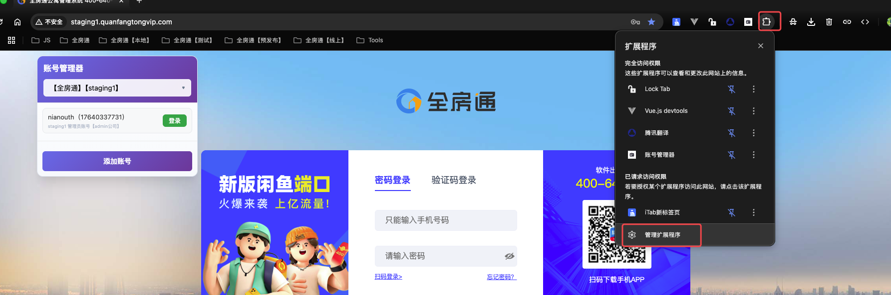

*说明：展示 Chrome 扩展管理页面的界面，包括开发者模式开关的位置*

2. **启用开发者模式**
   - 在扩展管理页面右上角
   - 打开"开发者模式"开关

3. **加载扩展程序**
   - 点击"加载已解压的扩展程序"按钮
   - 选择 account-manager 文件夹
   - 点击"选择文件夹"

**图 3-2：加载扩展程序**

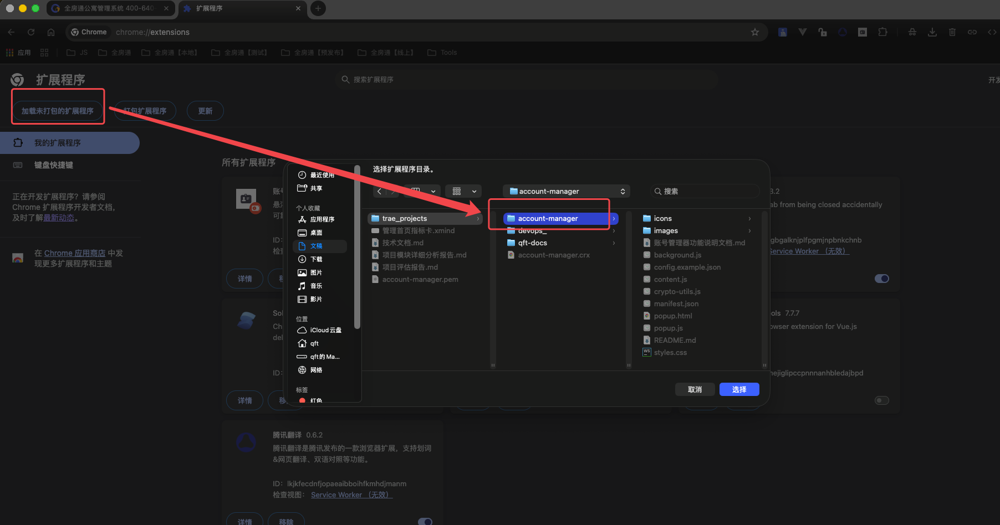

*说明：展示点击"加载已解压的扩展程序"按钮后的文件选择对话框*

4. **验证安装**
   - 扩展图标出现在浏览器工具栏
   - 扩展管理页面显示扩展信息
   - 版本号：1.1.0

**图 3-3：扩展安装成功**

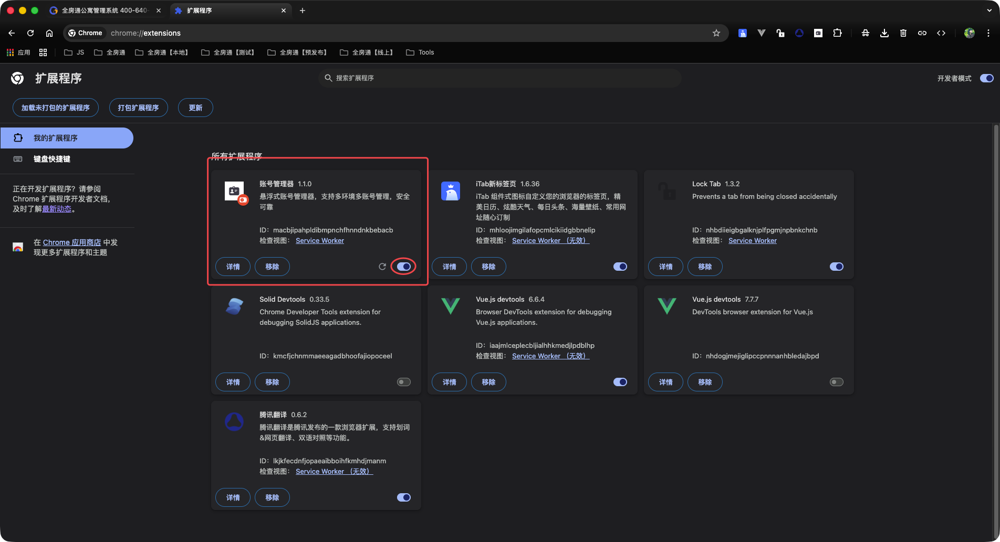

*说明：展示扩展安装成功后，在扩展管理页面和浏览器工具栏中的显示效果*

#### 3.1.3 安装后设置

1. **固定扩展图标**（可选）
   - 右键点击扩展图标
   - 选择"固定"选项
   - 方便快速访问

2. **检查扩展权限**
   - 扩展需要以下权限：
     - storage：存储数据
     - activeTab：访问当前标签页
     - scripting：注入脚本
   - 所有权限都是必要的，用于核心功能

### 3.2 初始配置

#### 3.2.1 首次使用

1. **打开扩展**
   - 点击浏览器工具栏的扩展图标
   - 弹出管理界面

2. **了解界面**
   - 熟悉环境列表区域
   - 了解账号列表区域
   - 查看功能按钮

3. **开始配置**
   - 按照使用需求添加环境
   - 为每个环境添加账号

#### 3.2.2 主密码设置（可选）

1. **设置主密码**
   - 首次使用加密功能时提示设置
   - 输入强密码作为主密码
   - 确认主密码

2. **密码要求**
   - 建议长度至少 8 位
   - 包含字母、数字、特殊字符
   - 不要使用常见密码

3. **记住主密码**
   - 主密码不存储，无法找回
   - 忘记主密码将无法解密数据
   - 建议妥善保管

### 3.3 环境设置

#### 3.3.1 添加第一个环境

1. **点击添加环境按钮**
   - 在弹出页面点击"+"按钮
   - 打开环境配置对话框

2. **填写环境信息**
   - 环境名称：如"开发环境"
   - 登录页面 URL：如"https://dev.example.com/login"
   - 登录按钮 ID/Class：（可选）

**图 3-4：环境配置示例**

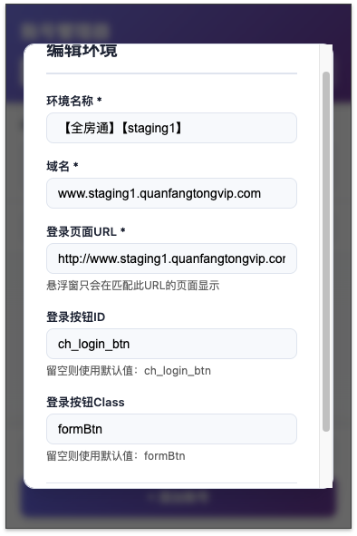

*说明：展示环境配置的完整示例，包括所有必填和可选字段*

3. **保存环境**
   - 点击"保存"按钮
   - 环境添加到列表
   - 自动切换到新环境

#### 3.3.2 配置多个环境

1. **开发环境配置**
   ```
   环境名称：开发环境
   登录 URL：https://dev.example.com/login
   ```

2. **测试环境配置**
   ```
   环境名称：测试环境
   登录 URL：https://test.example.com/login
   ```

3. **生产环境配置**
   ```
   环境名称：生产环境
   登录 URL：https://example.com/login
   ```

#### 3.3.3 环境配置优化

1. **登录按钮配置**
   - 打开目标网站的登录页面
   - 检查登录按钮的 ID 或 Class
   - 在环境配置中填写
   - 提高一键登录成功率

2. **URL 匹配优化**
   - 使用精确的登录页面 URL
   - 支持通配符匹配（如：/login/*）
   - 避免过于宽泛的匹配规则

### 3.4 账号添加

#### 3.4.1 添加第一个账号

1. **选择环境**
   - 在环境列表中选择目标环境
   - 确保环境已正确配置

2. **点击添加账号**
   - 点击"添加账号"按钮
   - 打开账号配置对话框

3. **填写账号信息**
   - 用户名：账号显示名称
   - 账号：登录账号（邮箱或用户名）
   - 密码：登录密码
   - 备注：（可选）账号说明

**图 3-5：账号配置示例**

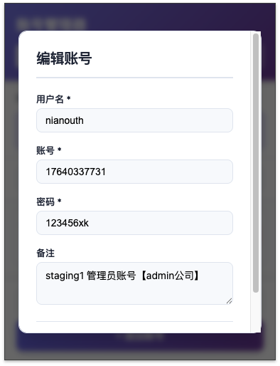

*说明：展示账号配置的完整示例，包括所有字段的填写方式*

4. **保存账号**
   - 点击"保存"按钮
   - 账号添加到列表
   - 可以立即使用

#### 3.4.2 批量添加账号

1. **逐个添加**
   - 重复添加账号流程
   - 为每个账号填写信息
   - 建议使用清晰的命名

2. **命名规范建议**
   - 用户名：环境-用途-序号（如：开发-测试账号1）
   - 备注：添加详细说明
   - 便于后续查找和管理

#### 3.4.3 账号信息管理

1. **编辑账号**
   - 点击账号列表中的"编辑"按钮
   - 修改账号信息
   - 保存修改

2. **删除账号**
   - 点击"删除"按钮
   - 确认删除操作
   - 账号永久删除

3. **搜索账号**
   - 使用搜索框输入关键词
   - 实时过滤账号列表
   - 支持用户名、账号、备注搜索

---

## 四、使用指南

### 4.1 环境管理操作

#### 4.1.1 切换环境

**方式一：弹出页面切换**
1. 点击扩展图标打开弹出页面
2. 在环境列表中选择目标环境
3. 账号列表自动更新

**方式二：悬浮面板切换**
1. 在网页上找到悬浮面板
2. 点击环境下拉框
3. 选择目标环境
4. 账号列表自动更新

**方式三：自动识别切换**
1. 访问配置的登录页面 URL
2. 插件自动识别环境
3. 自动切换到匹配的环境

#### 4.1.2 编辑环境

1. 在弹出页面找到目标环境
2. 点击环境的"编辑"按钮
3. 修改环境配置信息
4. 保存修改

#### 4.1.3 删除环境

1. 在弹出页面找到目标环境
2. 点击环境的"删除"按钮
3. 确认删除操作
4. 注意：删除环境会同时删除该环境下的所有账号

### 4.2 账号管理操作

#### 4.2.1 添加账号

1. **选择环境**
   - 确保已选择正确的环境

2. **打开添加对话框**
   - 点击"添加账号"按钮

3. **填写信息**
   - 用户名：必填，账号显示名称
   - 账号：必填，登录账号
   - 密码：必填，登录密码
   - 备注：选填，账号说明

4. **保存账号**
   - 点击"保存"按钮
   - 验证通过后保存成功

#### 4.2.2 编辑账号

1. **找到目标账号**
   - 在账号列表中查找
   - 或使用搜索功能

2. **打开编辑对话框**
   - 点击账号的"编辑"按钮

3. **修改信息**
   - 修改需要更新的字段
   - 密码留空表示不修改密码

4. **保存修改**
   - 点击"保存"按钮
   - 修改立即生效

#### 4.2.3 删除账号

1. **找到目标账号**
   - 在账号列表中查找

2. **确认删除**
   - 点击"删除"按钮
   - 确认删除操作

3. **删除完成**
   - 账号从列表中移除
   - 操作不可恢复

#### 4.2.4 搜索账号

1. **打开搜索框**
   - 在弹出页面找到搜索框

2. **输入关键词**
   - 输入用户名、账号或备注关键词
   - 实时显示匹配结果

3. **查看结果**
   - 账号列表自动过滤
   - 显示匹配的账号

4. **清除搜索**
   - 清空搜索框
   - 显示所有账号

### 4.3 一键登录操作

#### 4.3.1 使用弹出页面登录

1. **打开登录页面**
   - 在浏览器中打开目标网站的登录页面

2. **选择账号**
   - 点击扩展图标打开弹出页面
   - 选择目标环境
   - 在账号列表中找到目标账号

3. **执行登录**
   - 点击账号的"登录"按钮
   - 系统自动填充表单
   - 自动点击登录按钮

**图 4-1：一键登录操作流程**


*说明：展示从选择账号到完成登录的完整操作流程*

4. **验证登录**
   - 等待页面跳转
   - 确认登录成功

#### 4.3.2 使用悬浮面板登录

1. **打开登录页面**
   - 在浏览器中打开目标网站的登录页面

2. **查看悬浮面板**
   - 面板自动显示在页面右上角
   - 显示当前环境的账号列表

3. **选择账号登录**
   - 在面板中找到目标账号
   - 点击"登录"按钮
   - 系统自动完成登录

4. **面板操作**
   - 可以拖拽调整面板位置
   - 可以折叠/展开面板
   - 可以切换环境

#### 4.3.3 登录失败处理

1. **检查环境配置**
   - 确认登录页面 URL 配置正确
   - 检查登录按钮 ID/Class 是否正确

2. **检查账号信息**
   - 确认账号和密码正确
   - 检查账号是否过期

3. **手动登录**
   - 如果自动登录失败
   - 可以手动填写表单登录
   - 或使用浏览器密码管理器

4. **反馈问题**
   - 记录失败的具体情况
   - 检查浏览器控制台错误信息
   - 联系技术支持

### 4.4 悬浮面板使用

#### 4.4.1 面板基本操作

1. **显示/隐藏面板**
   - 面板默认自动显示
   - 可以点击折叠按钮隐藏
   - 再次点击展开

2. **拖拽移动**
   - 点击面板标题栏
   - 拖拽到目标位置
   - 松开鼠标完成移动
   - 位置自动保存

**图 4-2：面板拖拽操作**


*说明：展示拖拽面板移动位置的操作过程*

1. **切换环境**
   - 点击环境下拉框
   - 选择目标环境
   - 账号列表更新

2. **打开管理页面**
   - 点击"管理"按钮
   - 打开弹出页面
   - 进行详细配置

#### 4.4.2 面板功能使用

1. **查看账号列表**
   - 面板显示当前环境的所有账号
   - 显示用户名和账号信息
   - 不显示密码

2. **快速登录**
   - 点击账号的"登录"按钮
   - 自动填充并提交表单

3. **面板设置**
   - 面板位置自动保存
   - 折叠状态自动保存
   - 下次打开自动恢复

#### 4.4.3 面板自定义

1. **调整位置**
   - 拖拽面板到合适位置
   - 避免遮挡重要内容
   - 位置自动保存

2. **折叠管理**
   - 不需要时折叠面板
   - 需要时展开面板
   - 状态自动保存

3. **环境切换**
   - 在面板中快速切换环境
   - 无需打开弹出页面
   - 提高操作效率

### 4.5 数据备份操作

#### 4.5.1 备份数据

1. **打开备份功能**
   - 点击扩展图标打开弹出页面
   - 找到"备份数据"按钮

2. **生成备份文件**
   - 点击"备份数据"按钮
   - 系统生成 JSON 格式备份文件
   - 自动下载到本地

3. **保存备份文件**
   - 选择安全的存储位置
   - 建议使用有意义的文件名
   - 定期备份重要数据

4. **备份文件内容**
   - 包含所有环境配置
   - 包含所有账号信息
   - 包含备份时间戳
   - 包含插件版本信息

#### 4.5.2 恢复数据

1. **打开恢复功能**
   - 点击扩展图标打开弹出页面
   - 找到"恢复数据"按钮

2. **选择备份文件**
   - 点击"恢复数据"按钮
   - 选择之前备份的 JSON 文件
   - 确认文件选择

3. **验证数据**
   - 系统验证文件格式
   - 检查数据完整性
   - 确认数据有效

4. **执行恢复**
   - 确认恢复操作
   - 系统导入数据
   - 替换现有数据
   - 恢复完成

**图 4-3：数据恢复操作**

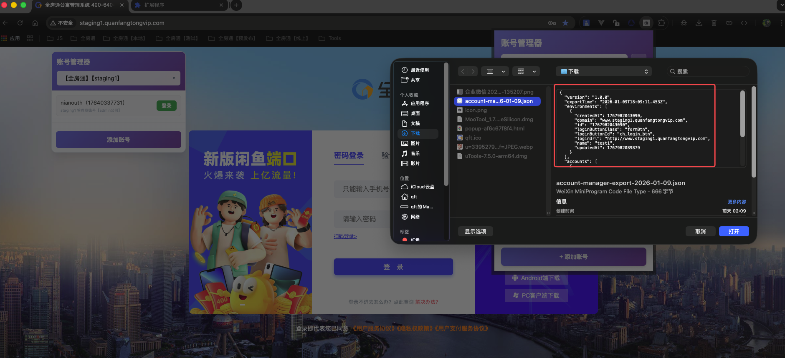

*说明：展示数据恢复的操作界面和文件选择对话框*

#### 4.5.3 备份策略建议

1. **定期备份**
   - 建议每周备份一次
   - 重要数据变更后立即备份
   - 保持多个备份版本

2. **备份存储**
   - 存储在安全的位置
   - 如果使用加密，妥善保管主密码
   - 考虑云存储备份（加密后）

3. **备份验证**
   - 定期测试备份文件
   - 确认可以正常恢复
   - 检查数据完整性

---

## 五、安全说明

### 5.1 数据加密机制

#### 5.1.1 加密算法

**AES-GCM 加密：**
- 使用 Web Crypto API 实现
- AES-256-GCM 算法
- 提供机密性和完整性保护
- 符合行业安全标准

**加密流程：**
1. 用户输入密码
2. 生成随机初始化向量（IV）
3. 使用主密码派生加密密钥
4. 使用 AES-GCM 加密密码
5. 存储加密数据和 IV

**图 5-1：数据加密流程示意图**


**安全特性：**
- 每次加密使用不同的 IV
- 相同明文产生不同密文
- 包含认证标签防止篡改
- 密钥不直接存储

#### 5.1.2 密钥管理

**密钥派生：**
- 使用 PBKDF2 算法派生密钥
- 基于主密码和盐值
- 迭代次数足够高
- 防止暴力破解

**密钥存储：**
- 密钥不直接存储
- 每次使用时临时派生
- 使用后立即清除
- 内存中不保留明文

#### 5.1.3 数据完整性

**完整性验证：**
- AES-GCM 提供内置完整性保护
- 每次解密时验证数据完整性
- 数据被篡改时解密失败
- 防止数据被恶意修改

### 5.2 隐私保护措施

#### 5.2.1 本地存储

**存储位置：**
- 数据存储在用户本地浏览器
- 使用 Chrome Storage API
- 不上传到任何服务器
- 完全离线工作

**数据隔离：**
- 每个 Chrome 用户配置文件独立
- 不同设备数据不共享
- 卸载扩展不自动删除数据
- 用户完全控制数据

#### 5.2.2 权限控制

**最小权限原则：**
- 只请求必要的权限
- storage：存储数据必需
- activeTab：访问当前标签页必需
- scripting：注入脚本必需

**权限说明：**
- 所有权限用于核心功能
- 不收集用户使用数据
- 不向第三方发送数据
- 不访问用户其他数据

#### 5.2.3 数据传输

**网络通信：**
- 扩展不进行网络通信
- 不向服务器发送数据
- 不接收服务器数据
- 完全本地运行

**数据同步：**
- 不强制数据同步
- 用户可选择 Chrome 同步
- 同步数据也经过加密
- 用户完全控制

### 5.3 安全使用建议

#### 5.3.1 主密码安全

**设置强密码：**
- 长度至少 8 位
- 包含大小写字母
- 包含数字
- 包含特殊字符
- 不使用常见密码

**密码管理：**
- 不要将主密码告诉他人
- 不要在主密码中使用账号密码
- 定期更换主密码
- 妥善保管主密码

**密码恢复：**
- 主密码不存储，无法找回
- 忘记主密码将无法解密数据
- 建议记录在安全的地方
- 考虑使用密码管理器

#### 5.3.2 数据备份安全

**备份文件安全：**
- 备份文件包含敏感信息
- 存储在安全的位置
- 如果使用加密，妥善保管主密码
- 不要将备份文件分享给他人

**备份存储建议：**
- 存储在加密的磁盘或文件夹
- 考虑使用加密的云存储
- 定期检查备份文件完整性
- 保持多个备份版本

#### 5.3.3 使用环境安全

**设备安全：**
- 在可信的设备上使用
- 不要在公共计算机上使用
- 使用后及时退出
- 定期检查设备安全

**浏览器安全：**
- 保持浏览器最新版本
- 安装安全更新
- 使用安全浏览器设置
- 避免安装可疑扩展

**账号安全：**
- 定期更新账号密码
- 使用强密码
- 启用双因素认证（如果支持）
- 及时删除不再使用的账号

---

## 六、技术架构

### 6.1 技术栈介绍

#### 6.1.1 核心技术

**前端技术：**
- HTML5：页面结构
- CSS3：样式和动画
- JavaScript (ES6+)：功能实现
- Chrome Extension API：扩展功能

**Chrome Extension：**
- Manifest V3：最新扩展规范
- Service Worker：后台服务
- Content Scripts：内容脚本
- Storage API：数据存储

**加密技术：**
- Web Crypto API：加密功能
- AES-GCM：加密算法
- PBKDF2：密钥派生

#### 6.1.2 开发规范

**代码规范：**
- ES6+ 语法
- 模块化设计
- 错误处理
- 代码注释

**安全规范：**
- 防止 XSS 攻击
- 安全的 DOM 操作
- 输入验证
- 数据加密

### 6.2 核心模块说明

#### 6.2.1 manifest.json

**功能：**
- 扩展配置文件
- 声明权限和功能
- 定义文件结构
- 配置扩展信息

**关键配置：**
- manifest_version: 3
- permissions: storage, activeTab, scripting
- content_scripts: 内容脚本配置
- background: 后台服务配置

#### 6.2.2 background.js

**功能：**
- 后台服务脚本
- 处理扩展生命周期
- 监听标签页变化
- 环境自动识别
- 数据备份恢复

**核心功能：**
- 扩展安装/更新处理
- 标签页 URL 监听
- 环境匹配逻辑
- 消息处理
- 数据存储操作

#### 6.2.3 content.js

**功能：**
- 内容脚本
- 注入到网页中
- 创建悬浮面板
- 实现一键登录
- 表单自动填充

**核心功能：**
- 悬浮面板创建和管理
- 环境切换处理
- 账号列表显示
- 表单识别和填充
- 登录按钮点击
- 面板拖拽功能

#### 6.2.4 popup.html/popup.js

**功能：**
- 弹出页面界面
- 环境和账号管理
- 数据备份恢复
- 用户交互处理

**核心功能：**
- 环境管理（增删改查）
- 账号管理（增删改查）
- 数据备份恢复
- 搜索功能
- 界面交互

#### 6.2.5 crypto-utils.js

**功能：**
- 加密工具类
- 密码加密解密
- 密钥管理
- 安全功能

**核心功能：**
- AES-GCM 加密
- AES-GCM 解密
- 密钥派生
- 主密码管理
- 数据完整性验证

#### 6.2.6 styles.css

**功能：**
- 样式文件
- 界面美化
- 响应式设计
- 动画效果

**设计特点：**
- 现代化 UI 设计
- 渐变色彩系统
- 流畅的动画效果
- 响应式布局

### 6.3 扩展架构设计

#### 6.3.1 架构概述

**三层架构：**
1. **表现层**：popup.html, content.js（用户界面）
2. **业务层**：popup.js, background.js（业务逻辑）
3. **数据层**：Chrome Storage API（数据存储）

**模块通信：**
- popup ↔ background：消息传递
- content ↔ background：消息传递
- popup ↔ content：通过 background 中转

#### 6.3.2 数据流

**数据读取流程：**
1. 用户操作触发
2. popup/content 发送消息
3. background 处理消息
4. 读取 Chrome Storage
5. 返回数据
6. 更新界面

**数据写入流程：**
1. 用户输入数据
2. 数据验证
3. popup/content 发送消息
4. background 处理消息
5. 写入 Chrome Storage
6. 更新界面

#### 6.3.3 安全架构

**加密流程：**
1. 用户输入密码
2. crypto-utils 加密
3. 存储加密数据
4. 读取时解密
5. 使用后清除

**权限控制：**
- 最小权限原则
- 只请求必要权限
- 权限说明清晰
- 用户可控制

---

## 七、常见问题

### 7.1 安装相关问题

#### Q1: 如何安装扩展？

**A:** 按照以下步骤安装：
1. 下载扩展文件包
2. 打开 Chrome 扩展管理页面（chrome://extensions/）
3. 启用"开发者模式"
4. 点击"加载已解压的扩展程序"
5. 选择扩展文件夹
6. 完成安装

#### Q2: 安装后看不到扩展图标？

**A:** 可能的原因和解决方法：
1. 图标被隐藏：右键点击浏览器工具栏，选择"扩展程序"，找到全房通账号管理器V1.0.0并固定
2. 扩展未启用：在扩展管理页面检查扩展是否已启用
3. 浏览器版本过低：需要 Chrome 88.0 及以上版本

#### Q3: 提示权限不足？

**A:** 扩展需要以下权限才能正常工作：
- storage：存储账号数据
- activeTab：访问当前标签页以填充表单
- scripting：注入脚本实现自动登录

这些都是核心功能必需的权限，不会用于其他用途。

### 7.2 使用相关问题

#### Q4: 如何添加环境？

**A:** 添加环境的步骤：
1. 点击扩展图标打开弹出页面
2. 点击"+"按钮添加环境
3. 填写环境名称、域名、登录页面 URL
4. 配置登录按钮 ID/Class（可选）
5. 点击"保存"

#### Q5: 如何一键登录？

**A:** 一键登录的方法：
1. 打开目标网站的登录页面
2. 在悬浮面板或弹出页面中选择账号
3. 点击"登录"按钮
4. 系统自动填充表单并提交

#### Q6: 一键登录失败怎么办？

**A:** 可能的原因和解决方法：
1. **登录按钮未识别**：在环境配置中填写登录按钮的 ID 或 Class
2. **表单结构不匹配**：某些网站的表单结构特殊，可能需要手动登录
3. **账号密码错误**：检查账号和密码是否正确
4. **页面未完全加载**：等待页面完全加载后再点击登录

#### Q7: 悬浮面板不显示？

**A:** 可能的原因：
1. 面板被折叠：点击折叠按钮展开
2. 面板被拖拽到屏幕外：重置面板位置
3. 某些页面不支持：chrome:// 等特殊页面不支持内容脚本

#### Q8: 如何搜索账号？

**A:** 搜索账号的方法：
1. 在弹出页面找到搜索框
2. 输入用户名、账号或备注关键词
3. 账号列表自动过滤显示匹配结果
4. 清空搜索框显示所有账号

### 7.3 安全相关问题

#### Q9: 账号信息是否安全？

**A:** 账号信息的安全性：
1. **本地存储**：数据存储在用户本地浏览器，不上传到服务器
2. **加密保护**：密码使用 AES-GCM 加密算法保护
3. **权限控制**：只请求必要的权限，不访问其他数据
4. **隐私保护**：不收集用户使用数据，不向第三方发送数据

#### Q10: 忘记主密码怎么办？

**A:** 主密码安全说明：
1. 主密码不存储，无法找回
2. 忘记主密码将无法解密加密的数据
3. 建议将主密码记录在安全的地方
4. 可以考虑使用密码管理器管理主密码

#### Q11: 如何备份数据？

**A:** 备份数据的步骤：
1. 点击扩展图标打开弹出页面
2. 点击"备份数据"按钮
3. 系统生成 JSON 格式备份文件
4. 下载并保存到安全的位置

#### Q12: 如何恢复数据？

**A:** 恢复数据的步骤：
1. 点击扩展图标打开弹出页面
2. 点击"恢复数据"按钮
3. 选择之前备份的 JSON 文件
4. 确认恢复操作
5. 数据恢复完成

**注意：** 恢复操作会替换所有现有数据，恢复前建议先备份当前数据。

#### Q13: 数据会同步到其他设备吗？

**A:** 数据同步说明：
1. 默认情况下，数据不会自动同步到其他设备
2. 如果开启了 Chrome 同步功能，数据可能会同步
3. 同步的数据也经过加密保护
4. 用户可以在 Chrome 设置中控制同步行为

### 7.4 其他问题

#### Q14: 支持哪些浏览器？

**A:** 浏览器支持：
- Chrome 88.0 及以上版本
- 基于 Chromium 的浏览器（如 Edge、Brave 等）
- 不支持 Firefox、Safari 等非 Chromium 浏览器

#### Q15: 可以管理多少个账号？

**A:** 账号数量限制：
- 理论上没有硬性限制
- 受 Chrome Storage API 存储限制（通常为 10MB）
- 建议每个环境管理不超过 100 个账号
- 如果账号很多，建议使用搜索功能

#### Q16: 可以导出账号密码吗？

**A:** 密码导出说明：
1. 备份文件包含所有账号信息
2. 如果使用加密，密码以加密形式存储
3. 需要主密码才能解密查看
4. 建议妥善保管备份文件和主密码

---

## 八、版本信息

### 8.1 当前版本

**版本号：** 1.1.0

**发布日期：** 2024年

**版本特点：**
- 完整的账号管理功能
- 双界面操作模式
- 数据加密保护
- 一键自动登录
- 数据备份恢复

### 8.2 更新日志

#### v1.1.0 (2024年)
- 初始发布版本
- 实现环境和账号管理功能
- 支持一键登录和自动环境切换
- 实现数据加密功能
- 双界面操作模式（弹出页面和悬浮面板）
- 数据备份与恢复功能
- 改进 UI 设计和用户体验

### 8.3 未来规划

**计划功能：**
- 账号密码自动生成
- 账号使用统计
- 批量导入导出账号
- 快捷键操作支持
- 多账号同时登录
- 增强表单自动填充兼容性
- 支持更多网站登录表单
- 账号分组功能
- 标签和分类管理
- 账号过期提醒

**技术改进：**
- 性能优化
- 代码重构
- 错误处理改进
- 用户体验优化
- 安全性增强

---

## 附录

### A. 快捷键说明

（未来版本将支持快捷键操作）

### B. 截图说明

**截图文件组织：**
- 所有截图文件应存放在 `images/` 目录下
- 截图文件命名规范：使用英文和连字符，如 `main-interface.png`
- 建议截图分辨率：1920x1080 或更高
- 截图格式：PNG（支持透明背景）或 JPG

**截图清单：**
1. `main-interface.png` - 插件主界面概览
2. `popup-interface.png` - 弹出页面管理界面
3. `floating-panel.png` - 悬浮面板操作界面
4. `floating-panel-collapsed.png` - 悬浮面板折叠状态
5. `add-environment.png` - 添加环境配置界面
6. `environment-list.png` - 环境列表展示
7. `add-account.png` - 添加账号界面
8. `account-list.png` - 账号列表展示
9. `login-before.png` - 一键登录前（登录页面）
10. `login-after.png` - 一键登录后（自动填充）
11. `form-fill-animation.gif` - 表单自动填充过程（可选）
12. `backup-data.png` - 数据备份界面
13. `chrome-extensions-page.png` - Chrome 扩展管理页面
14. `load-extension.png` - 加载扩展程序
15. `extension-installed.png` - 扩展安装成功
16. `environment-config-example.png` - 环境配置示例
17. `account-config-example.png` - 账号配置示例
18. `login-process.png` - 一键登录操作流程
19. `panel-drag.png` - 面板拖拽操作
20. `restore-data.png` - 数据恢复操作
21. `encryption-process.png` - 数据加密流程示意图

### C. 配置文件格式

**环境配置格式：**
```json
{
  "id": "env_001",
  "name": "开发环境",
  "loginUrl": "https://dev.example.com/login",
  "loginButtonId": "ch_login_btn",
  "loginButtonClass": "formBtn",
  "createdAt": 1704067200000,
  "updatedAt": 1704067200000
}
```

**账号配置格式：**
```json
{
  "id": "acc_001",
  "envId": "env_001",
  "username": "开发账号1",
  "account": "dev_user1@example.com",
  "password": "your_encrypted_or_plain_password_here",
  "note": "开发环境测试账号",
  "createdAt": 1704067200000,
  "updatedAt": 1704067200000
}
```

### C. 技术支持

**获取帮助：**
- GitLab: //121.42.43.167:10010/zhangjianlong/account-manager.git
- 提交 Issue 反馈问题
- 查看文档获取更多信息

### D. 许可证

本项目采用 MIT 许可证。

---

**文档版本：** 1.0  
**最后更新：** 2026-01-11 
**文档作者：** zhangjianlong
